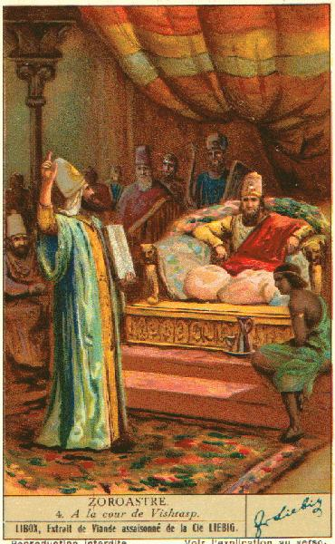

# Asha MCP
A Chess MCP server powered by Stockfish.

<!-- Image: https://upload.wikimedia.org/wikipedia/commons/b/bd/Moors_from_Andalusia_playing_chess.jpg -->
<table>
  <tr>
    <td style="vertical-align: top;">
      
    </td>
    <td style="vertical-align: top; padding-left: 16px;">
      <em>King Vishtaspa of Persia became extremely bored with life, having accomplished everything he wished. The King offered an unlimited reward to anyone who could give him interest in life. Zarathustra appeared with the original form of chess: the Art of Asha, and through it demonstrated to the King all the laws of the universe and life.</em>
    </td>
  </tr>
</table>


## Installation 
### MacOS
Install [Homebrew](https://brew.sh), followed by an installation of Python 3.12, Cairo and uv
```bash
brew install python@3.12 cairo uv
```
Clone this repository, then within the repository directory run 
```bash 
uv sync
uv build .
```

### Linux
Follow the installation instructions for `uv` [here](https://docs.astral.sh/uv/getting-started/installation/). Then, install `libcairo` and `libjpeg` using 
```bash
sudo apt-get update
sudo apt-get install -y \
    libcairo2-dev \
    libjpeg-dev
```
Then, build with `uv` after cloning the repo. 

```bash 
uv sync
uv build .
```

## Integrate with Claude Code
Add the following line to Claude `claude_desktop_config.json` (details [here](https://modelcontextprotocol.io/quickstart/user)), replacing the path with the appropriate path to the local clone of this repository.
```json
{
  "mcpServers": {
    "chess": {
      "command": "uv",
      "args": [
        "--directory",
        "/path/to/asha-mcp", // should point to the cloned repo
        "run",
        "asha"
      ]
    }
  }
}
```

## Methods
